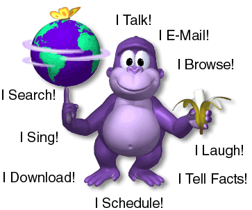
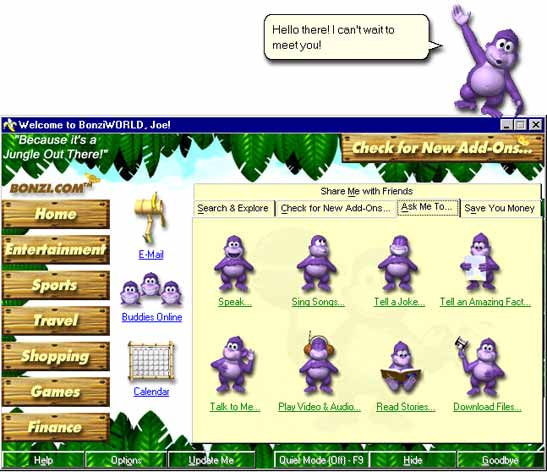
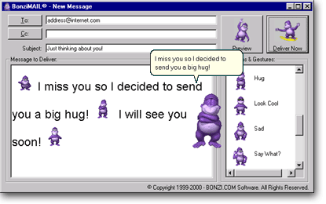
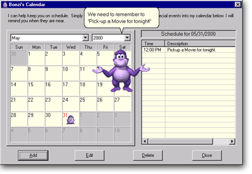
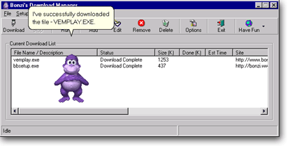

# BonziBUDDY: bonzi.link reference

Research date: 2026-10-05. This document centers the exact site supplied by the user: [bonzi.link](https://bonzi.link/).

## What this site is

The inspected page is a promotional/download page, not an in-browser conversational assistant. Its download links target `https://bonzi.link/bon4.zip`. The ZIP was not downloaded or executed, so its version, contents, authenticity, and functionality remain unverified. The page's historical branding does not establish the present operator's relationship to BONZI Software.

The page advertises a desktop companion that speaks, entertains, assists browsing, handles email and downloads, and offers shopping help. These are marketing claims, not current service tests. Its listed requirements are historical: 16 MB RAM, 11 MB disk space, Windows 9x/NT 4/ME/2000, a sound card, and Internet Explorer 5 or later. [Source: live page](https://bonzi.link/).

## The character

Direct observations from the [character artwork](https://bonzi.link/images/bbabilities2.gif):

- A friendly, rounded purple gorilla with a large head and belly, long bent arms, short legs, broad hands, and splayed bare feet.
- Darker violet outer body; much lighter lavender muzzle, eye surround, and oval belly. Shading gives the body volume without individually rendered fur strands.
- Very large white eyes, close-set dark pupils, small rounded ears, a broad projecting muzzle, a small nose, and an upturned smile. The top of the head rises into a modest central tuft/ridge.
- No clothing, tail, or permanent accessories in this pose. The light stomach is a body patch.
- The promotional pose balances a purple-and-green globe on one hand and holds a peeled banana in the other. A yellow butterfly and a pale ring accompany the globe.
- The finish resembles small, pre-rendered 3D clip art: glossy highlights, soft shadows, rounded forms, and visibly limited resolution.

The file is 363 × 303 pixels and contains seven GIF frames. That is the marketing graphic's size and frame count, not the desktop character's native animation specification.

## BonziWORLD and the main controls

The [547 × 472 introduction image](https://bonzi.link/images/meetyou.jpg) shows an old Windows window with a blue title bar and beveled controls, decorated with jungle foliage and wood/bamboo textures. A pale yellow main panel contrasts with the dark green borders. The left navigation uses stacked wooden signs for topic categories. Email, online buddies, and calendar occupy a narrower icon column.

The main panel uses separate Bonzi poses as command icons: speaking, singing, jokes, facts, conversation, media playback, stories, and downloads. An upper row provides search, add-ons, questions, and shopping controls. The bottom contains help, options, update, quiet mode, hide, and exit controls; quiet mode shows an F9 shortcut. These are controls pictured in a screenshot, not functional controls on the current webpage.

Bonzi stands outside the pictured window near its upper-right edge, waving beside a cream speech balloon. This makes the mascot appear to inhabit the desktop independently of the utility window. The balloon has dark text, a thin outline, rounded corners, a directional tail, and a drop shadow.

## Email

The [415 × 260 email image](https://bonzi.link/images/bbmail.gif) shows a gray Windows composer with recipient, copy, and subject fields. Large preview and delivery buttons sit at the top right. A message editor dominates the left side; a scrollable gestures list sits on the right.

Small Bonzi figures appear inline with message text, representing actions in the message. A larger character overlaps the editor and speaks in a cream balloon. The visible example combines a friendly greeting with a hug. This reference is useful for the relationship between typed content, gesture selection, preview, and character performance; it does not demonstrate a working email service today.

## Calendar

The [415 × 287 calendar image](https://bonzi.link/images/bbcalendar.gif) shows month/year selectors above a monthly grid, alongside an appointment table with time and description columns. Add, edit, delete, and close buttons sit below. Bonzi overlaps the calendar with both arms extended while a balloon presents a reminder.

The screenshot shows May 2000, pale cream cells, gray window chrome, a blue title bar, and a small Bonzi marker on an appointment date. The mascot is a presenter layered over the conventional organizer, not a replacement for its calendar interface.

## Download manager

The [415 × 210 download image](https://bonzi.link/images/bbdownload.gif) shows a toolbar above a tabular queue, with columns for file, status, size, progress, estimated time, and site. Two entries display completed status. Bonzi stands over the list and announces a completed download in a balloon.

The interface is dense, gray, and utilitarian. Tiny toolbar icons and separators distinguish actions. The character and balloon supply the playful notification layer. The image proves the advertised interface existed as artwork; download resumption or interception was not exercised during this research.

## Other visual assets

| Asset | Observed role |
| --- | --- |
| [Logo](assets/bonzi-link/buddylogowbonz.gif) | Slanted, heavy lettering with a purple dimensional treatment on BUDDY; small mascot and globe alongside it. |
| [Vine pose](assets/bonzi-link/bbvine.gif) | Gorilla suspended diagonally from a green vine, with limbs extended. The file itself is a single frame. |
| [Search pose](assets/bonzi-link/bbsearch.gif) | Small supplementary character image; inspect the original before using as animation evidence. |
| [Banana icon](assets/bonzi-link/banana24.gif) | 22 × 19 decorative list bullet. |
| [Face icon](assets/bonzi-link/bonz24.gif) | 24 × 24 compact character identifier. |
| [Jungle header](assets/bonzi-link/junglebackground.gif) | Foliage, bright sky, and branding; nine GIF frames. |
| [Bamboo frame](assets/bonzi-link/bambooad.gif) | Yellow bamboo and foliage around an advertising area. |
| [Separator](assets/bonzi-link/sepbar.jpg) | Thin purple/pink shaded divider. |

Source URLs and measured metadata for every file are in the [manifest](assets/bonzi-link/manifest.json). Frames were counted from image files; complete frame-by-frame motion was not analyzed.

## Website structure and typography

The page source uses a fixed 1174-pixel container, absolutely positioned blocks, and primarily 13-pixel Arial/Helvetica text. It specifies purple accents `#800080` and `#8551BB`; the large surrounding brand text requests Comic Sans MS. These are page styles, not a measured palette for Bonzi's skin.

The live browser view includes jungle imagery at the top, a logo area, a green slogan strip, repeated download links, character artwork, stacked product screenshots, and a requirements/footer area. Third-party advertising appears around and over this content. Its creative varies and should not be treated as original Bonzi artwork. [Source: page HTML and live browser observation](https://bonzi.link/).

## Guidance for a future interpretation

These are design recommendations based on the references, not claims about undocumented original behavior:

1. Start with the head, eyes, muzzle, belly, and long-arm silhouette. Color alone will not make a generic gorilla read as this character.
2. Keep the mascot visually separate from the main window, with a nearby speech balloon and clear speaking/idle states.
3. Match the chosen fidelity: either small raster artwork or a deliberately modernized model. Upscaling the old images cannot recover missing detail.
4. Use gestures to accompany meaningful actions: greeting, speaking, reminders, and completed tasks.
5. Preserve clear controls for quiet mode, hiding, and quitting. Provide text alongside speech and respect reduced-motion preferences.
6. Treat the jungle, bamboo, cream panels, and gray Windows controls as a coordinated visual reference if recreating the pictured interface.

## What remains unknown

No original asset license, complete animation inventory, precise gorilla RGB palette, native character frame dimensions, speech settings, installer identity, or present-day backend functionality was established. A full behavioral reconstruction would need a separately scoped inspection of a verified software build. Screenshots and marketing copy cannot establish those details.
